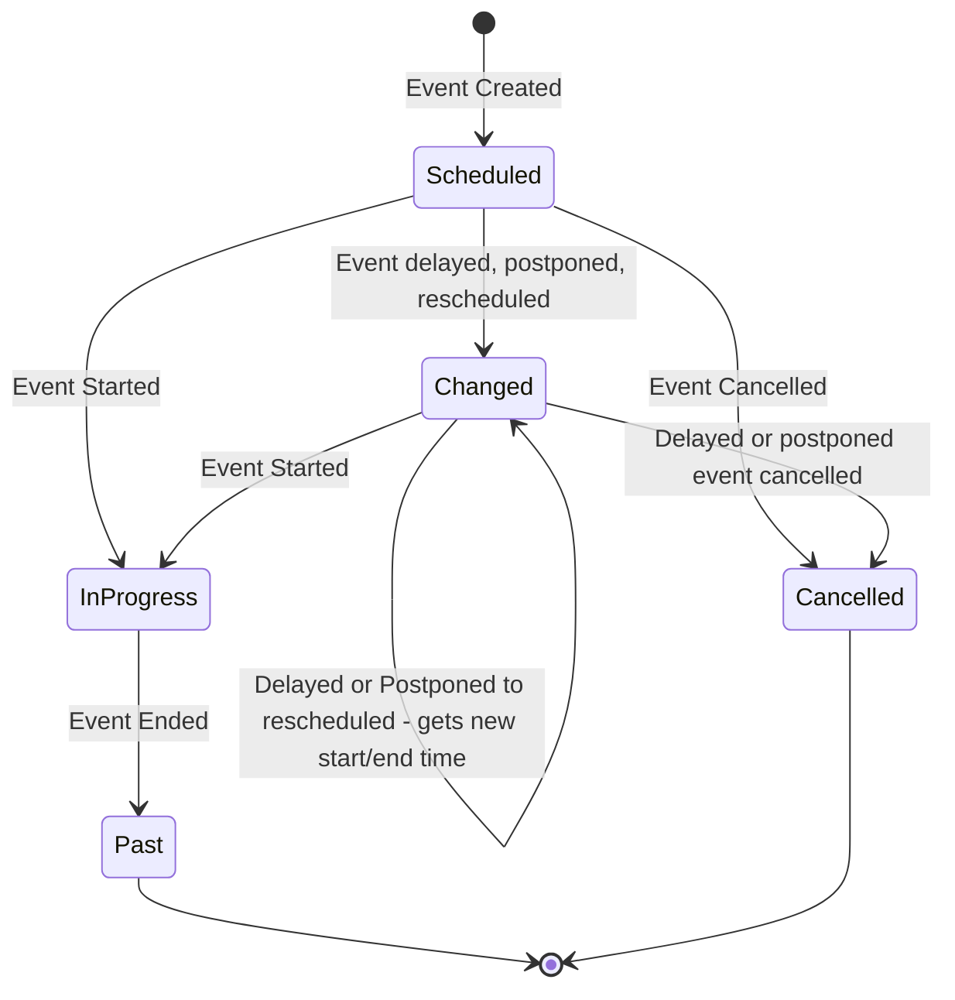

Events are occurrences in time during which something happens.  E.g. a football game is played, a play or musical or musical piece is performed.  An event could also be a school dance, or a protest march.

Events have venues and locations.  The location would be "the large gymnasium" or "the north east baseball diamond" - the venue would be the organization (e.g. school) at which the location is located.

Events have a startTime and an endTime - this is when the event will take place.

V2 note - we would like to add scheduled start/end and actual start/end to help track delays and also some form of setup start, teardown end by such that volunteers or concessions know when they can start setting up and when the have to be done by.

Events happen because of organizations.

The sponsoring organization is the reason the event is happening - eg Hogwarts Quidditch team, or the glee club or drama club.  The sponsoring organization is the "home team"
Participating organizations include the opposing team in sports events but also include the chearleeding squads, Band(s) - any other organization that might be drawing in attendees to the event.  Any organization that can lay claim to a portion of the sales made.
Supporting organizations are there to help, and though they may get paid, they are not bringing in attendees - so any payment would be independent of attendence - and may also be in the form of school credit - eg Environment credit for cleaning up after the event - though you'd have to be part of an organization (which could be created for this one event I suppose)

Events (state) can be
* Scheduled - will occur in the future.
* InProgress - occurring now.
* Changed - not started but "now" is past the start date time. - Could be Postponed (ie to be resceduled), Delayed (will start soonish), Rescheduled (new start time)
* Past - occurred in the past.
* Cancelled - Did not occur, will not occur.
* Pending - V2 idea - where an event can be created with no start/end time at creation.

Events have owners.  Owners are the admins for the sponsoring organization.

Events can be public or private.  Private events are only visible to members of the sponsoring, participating and supporting organizations.  Note for many private events there will only be a sponsoring organization - eg team practice.
Public events are visible to any one looking for public events in the organization hierarchy.

//QUESTION
Push notifications of event creation? - Do we want push notification (and to whom) on event creation?  Would perhaps mean the creation of a Notification "service"

//V2 maybe type CreatePendingEvent is command {eventId:EventId, eventInfo:EventInfo, actingMember:MemberId} briefly "create an event with Pending state - meaning no start time or endtime is expected (but may be provided - ie tentative dates).  Duration may or may not be provided as well"
//V2 maybe type PendingEventCreated is event {eventId:EventId, eventInfo:EventInfo, eventMetaInfo:EventMetaInfo}
//V2 maybe type ScheduleEvent is command {eventId:EventId, startDateTime:DateTime, endDateTime:DateTime?, duration:Duration?, actingMember:MemberId} briefly "schedules an event using the start time and at least on of duration/endtime to calculate the missing field (if missing) - both may be supplied."
//V2 maybe type EventScheduled is event {eventId:EventId, eventInfo:EventInfo, eventMetaInfo:EventMetaInfo}
//V2type GetLateStarts is query {organizationId:OrganizationId, duration:Duration} briefly "get all Past events where sponsoring/hosting org is provided org id and actual startdatetime is greater than scheduledstartdatetime + duration"
//V2 type LateStarts is result {eventData:EventData*}

// Feature "Add an event" is {
//     Scenario "Event venue/location schedule overlaps existing event " is {
//         When the VenueId and LocationId are scheduled
//         And the event start/end overlap an existing event at the same venue/location
//         Then the event creation is rejected due to scheduling conflict of venue/location
//     }

//     Scenario "Event that doesn't overlap with schedule,location and venue" is {
//         When the event venue, location and schedule do not overlap with any existing events
//         Then the event is created
//     }
// }

// Feature "Modify an event" is {
//     Scenario "Event is cancelled" is {
//         When an event cancellation is requested
//         And the event is not Cancelled or Past 
//         Then the event is cancelled
//     }

//     Scenario "Event is changed to delayed" is {
//         When an event is Scheduled 
//         And a change event request with a Delayed changeType is received
//         Then the event is set to Changed with a changeType of Delayed.
//     }

//     Scenario "Event is ended" is {
//         When an event is InProgress
//         And an EndEvent request is made
//         Then the event is set to Past
//     }

//     Scenario "Event is InProgress but endDateTime is passed" is {
//         When an event is InProgress
//         And the endDateTime is in the past by parameter-delayed
//         Then the Event is set to Past
//     }

// }
